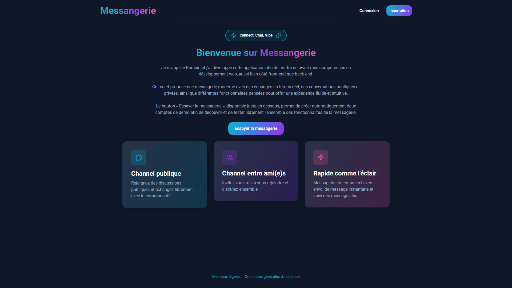
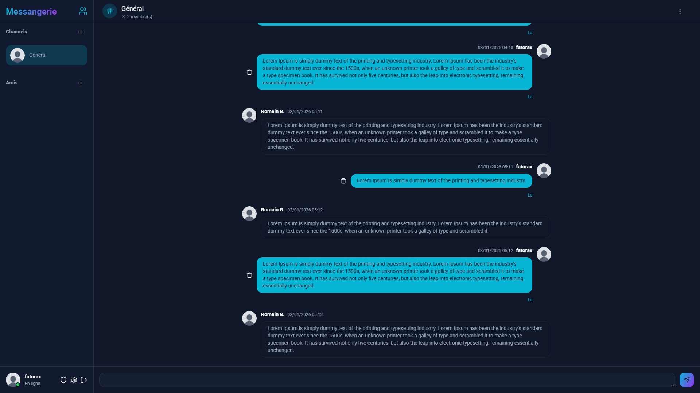
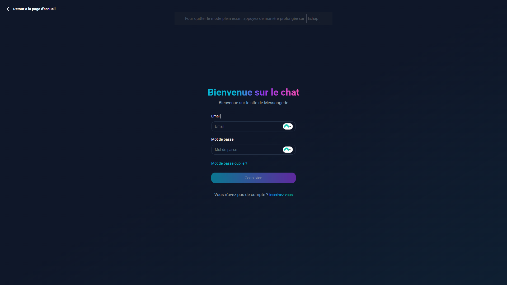
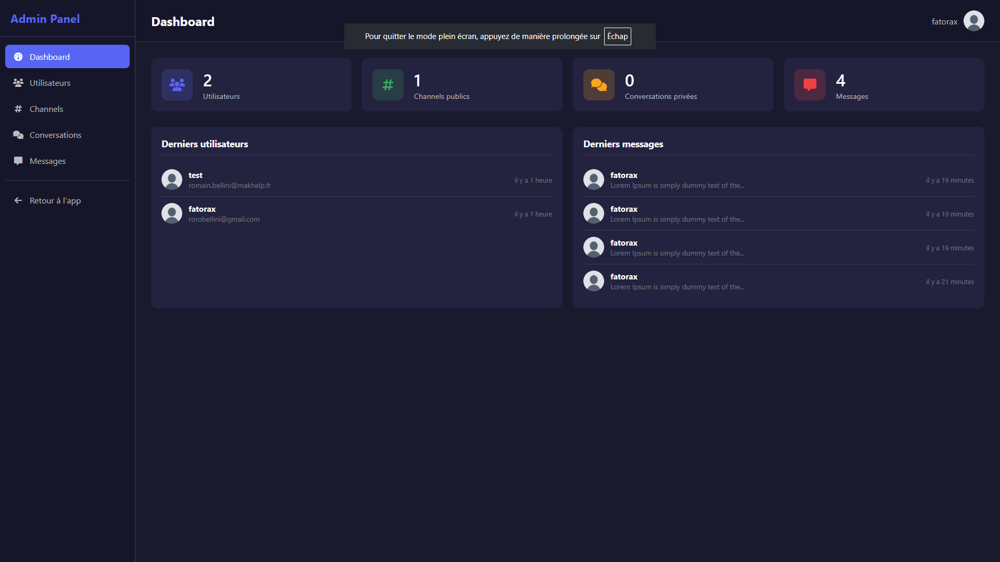

# 💬 Messangerie

[](https://laravel.com)
[](https://php.net)
[](https://pusher.com)

> Application de messagerie instantanée en temps réel développée avec Laravel et Pusher.

🌐 **Démo en ligne** : [messangerie.fatorax.fr](https://messangerie.fatorax.fr/)

---

## 📸 Aperçu

<div align="center">

<!-- Remplacer par vos screenshots -->
| Page d'accueil | Interface de chat |
|:-:|:-:|
|  |  |

| Connexion | Panel Admin |
|:-:|:-:|
|  |  |

</div>

---

## 🎯 Objectif du projet

Ce projet a été réalisé dans le cadre de ma recherche d'**alternance en développement web**. Il me permet de :

- 🚀 Me challenger sur des technologies modernes
- 📚 Approfondir mes connaissances en Laravel et WebSockets
- 💼 Démontrer mes compétences techniques à travers un projet concret

---

## ✨ Fonctionnalités

### 🔐 Authentification
- Inscription avec vérification par email
- Connexion / Déconnexion sécurisée
- Récupération de mot de passe
- Comptes de démonstration (durée de vie : 24h)

### 💬 Messagerie en temps réel
- **Channels publics** : groupes de discussion ouverts
- **Conversations privées** : messagerie entre deux utilisateurs
- Envoi et suppression de messages instantanés
- Indicateurs de lecture des messages
- Mise à jour en temps réel via WebSockets

### 👥 Système d'amis
- Recherche d'utilisateurs
- Envoi de demandes d'ami
- Acceptation / Refus / Annulation des demandes
- Création automatique de conversation privée à l'acceptation

### ⚙️ Gestion du profil
- Modification des informations personnelles
- Upload d'avatar personnalisé
- Changement de mot de passe
- Suppression de compte (avec nettoyage complet des données)

### 🛡️ Panel d'administration
- Dashboard avec statistiques globales
- Gestion des utilisateurs (CRUD)
- Gestion des channels publics
- Gestion des conversations privées
- Gestion des messages
- Recherche, filtrage et tri avancés
- Confirmation des actions sensibles (SweetAlert2)

---

## 🛠️ Stack technique

### Back-end
| Technologie | Utilisation |
|-------------|-------------|
| **Laravel 12** | Framework PHP principal |
| **PHP 8.2+** | Langage serveur |
| **Pusher** | WebSockets temps réel |
| **MySQL** | Base de données |

### Front-end
| Technologie | Utilisation |
|-------------|-------------|
| **Blade** | Moteur de templates |
| **SCSS** | Styles personnalisés |
| **Laravel Echo** | Client WebSockets |
| **SweetAlert2** | Modales et alertes |
| **Vite** | Build tool |

### Outils
| Outil | Utilisation |
|-------|-------------|
| **Pest** | Tests unitaires et fonctionnels |
| **Git** | Versionning |

---

## 📦 Installation

### Prérequis
- PHP >= 8.2
- Composer
- Node.js >= 18
- MySQL
- Compte [Pusher](https://pusher.com) (gratuit)

### Étapes

1. **Cloner le repository**
```bash
git clone https://github.com/fatorax/messangerie.git
cd messangerie
```

2. **Installer les dépendances**
```bash
composer install
npm install
```

3. **Configuration de l'environnement**
```bash
cp .env.example .env
php artisan key:generate
```

4. **Configurer le fichier `.env`**
```env
# Base de données
DB_CONNECTION=mysql
DB_HOST=127.0.0.1
DB_PORT=3306
DB_DATABASE=messangerie
DB_USERNAME=root
DB_PASSWORD=

# Pusher (WebSockets)
BROADCAST_DRIVER=pusher
PUSHER_APP_ID=your_app_id
PUSHER_APP_KEY=your_app_key
PUSHER_APP_SECRET=your_app_secret
PUSHER_APP_CLUSTER=eu

# Mail (pour la vérification d'email)
MAIL_MAILER=smtp
MAIL_HOST=your_smtp_host
MAIL_PORT=587
MAIL_USERNAME=your_username
MAIL_PASSWORD=your_password
MAIL_FROM_ADDRESS=noreply@example.com
```

5. **Créer la base de données et exécuter les migrations**
```bash
php artisan migrate
```

6. **Créer le lien symbolique pour le storage**
```bash
php artisan storage:link
```

7. **Compiler les assets**
```bash
npm run build
```

8. **Lancer l'application**
```bash
# Option 1 : Script tout-en-un (serveur + queue + vite)
composer dev

# Option 2 : Manuellement
php artisan serve
php artisan queue:listen
npm run dev
```

L'application est accessible sur `http://localhost:8000`

---

## 🧪 Tests

```bash
# Lancer tous les tests
composer test

# Ou directement avec Pest
php artisan test
```

---

## 📁 Structure du projet

```
messangerie/
├── app/
│   ├── Console/Commands/     # Commandes Artisan (ex: suppression comptes démo)
│   ├── Events/               # Events WebSocket (MessageSent, etc.)
│   ├── Http/
│   │   ├── Controllers/      # Controllers organisés par domaine
│   │   ├── Middleware/       # Middlewares personnalisés
│   │   └── Requests/         # Form Requests
│   ├── Mail/                 # Classes Mailable
│   └── Models/               # Modèles Eloquent
├── resources/
│   ├── js/                   # JavaScript (Echo, etc.)
│   ├── scss/                 # Styles SCSS
│   └── views/                # Templates Blade
├── routes/
│   ├── web.php               # Routes web
│   └── channels.php          # Channels WebSocket
└── ...
```

---

## 🔮 Évolutions futures

- [ ] Recadrage personnalisé des images uploadées (photo de profil & conversations)
- [ ] Envoi de fichiers et images dans les messages
- [ ] Réactions aux messages (emojis)
- [ ] Thème sombre / clair
- [ ] Application mobile (React Native / Flutter)
- [ ] Chiffrement de bout en bout

---

## 👨‍💻 À propos de moi

<div align="center">

**Romain Bellini** · *@fatorax*

Développeur web passionné, actuellement à la recherche d'une **alternance** pour continuer à développer mes compétences.

[](https://cv.fatorax.fr/)
[](https://github.com/fatorax)

</div>

---

<div align="center">

⭐ **Si ce projet vous plaît, n'hésitez pas à lui donner une étoile !** ⭐

</div>
